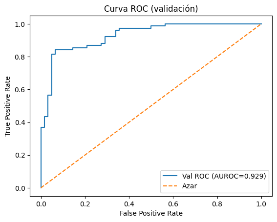

# Heart Disease Prediction with PyTorch (MLP)

Binary classification of HeartDisease from routine clinical variables, built in a single Jupyter notebook.
The pipeline covers EDA → stratified splits → preprocessing with no data leakage → MLP training → threshold tuning → ROC/PR evaluation.

### Highlights

Clean, reproducible pipeline (fixed seeds, no leakage).

Minimal, readable preprocessing (z-score for numeric; one-hot for categoricals).

PyTorch MLP with dropout and weight decay.

Validation-driven threshold selection (maximize F1).

Robust evaluation with ROC, Precision-Recall, confusion matrix, and AUROC/AUPRC.

### Reference validation results (from the included run):

AUROC ≈ 0.929

AUPRC ≈ 0.942

Test metrics are reported twice in the notebook: at threshold 0.5 and at the best F1 threshold chosen on validation.

# Project Structure
cardiovascular_illness/
├─ 01_proyecto.ipynb      # Main notebook: EDA → training → eval
└─ dataset/
   └─ heart.csv           # Input data

## Data

File: dataset/heart.csv

Target column: HeartDisease ∈ {0, 1}

Features used:
Age, Sex, ChestPainType, RestingBP, Cholesterol, FastingBS, RestingECG, MaxHR, ExerciseAngina, Oldpeak, ST_Slope

* Assumptions / rules

Cholesterol == 0 is treated as missing and imputed with the median (calculated on train only).

Numerical columns are z-scored using train mean/std (std=1.0 if originally 0).

Categorical columns (Sex, ChestPainType, RestingECG, ExerciseAngina, ST_Slope) are one-hot encoded with columns fixed from train (val/test reindexed).

# Environment & Installation

Python 3.9+ recommended

# (optional) create a virtual environment
python -m venv .venv

# activate
# Windows:
.venv\Scripts\activate
# macOS / Linux:
source .venv/bin/activate

# install dependencies
pip install pandas numpy matplotlib scikit-learn torch jupyter

Open the notebook:

jupyter notebook 01_proyecto.ipynb

GPU is used automatically if available (torch.cuda.is_available()).

# How the Pipeline Works

* Load & sanity check
Shape, dtypes, missing values, and target distribution.

* EDA

Class balance bar plot

Histograms & boxplots of numeric features

Correlation matrix (Pearson) for numeric + target

* Stratified Split (seed=42)

70% Train, 15% Validation, 15% Test (two-stage train_test_split)

Class proportions printed for each split

* Preprocessing (fit on train, apply to val/test)

Cholesterol==0 → NaN → median imputation

Numeric: median imputation → z-score

Categorical: one-hot (fixed columns from train)

* PyTorch Dataset & DataLoader

Tensors built from the preprocessed arrays

batch_size=64, shuffle on train only

* Model: MLP (PyTorch)

Layers: in_features → 128 → 32 → 1

Activation: ReLU; Dropout p=0.325

Loss: BCEWithLogitsLoss

Optimizer: Adam(lr=1e-3, weight_decay=1e-4)

Epochs: 250

* Validation & Threshold Tuning

Compute ROC and PR on validation

Choose best threshold by max F1 on validation

* Test Evaluation

Report metrics at threshold 0.5 and best-F1:
Accuracy, Precision, Recall, F1, AUROC (threshold-free), and confusion matrix [[TN, FP], [FN, TP]].

# Results & Plots

The notebook renders the following:

ROC (Validation) — AUROC ≈ 0.929

Precision–Recall (Validation) — AUPRC ≈ 0.942

# Reproducibility

random_state=42 in all splits

torch.manual_seed(42) for model

All preprocessing statistics are fit only on train and reused for val/test

# Configuration:

| Setting        | Value (default)   |
| -------------- | ----------------- |
| `batch_size`   | 64                |
| `epochs`       | 250               |
| `lr`           | 1e-3              |
| `weight_decay` | 1e-4              |
| `dropout`      | 0.325             |
| Hidden sizes   | 128 → 32          |
| Loss           | BCEWithLogitsLoss |
| Optimizer      | Adam              |
